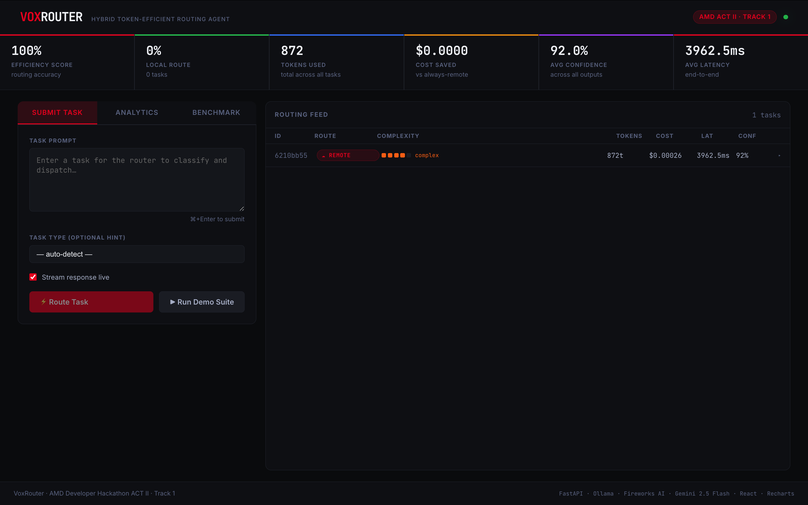

# VoxRouter — Hybrid Token-Efficient Routing Agent

> Route every AI task to the cheapest model that can handle it.
> Local when possible. Remote when necessary. Always efficient.




---

## What is VoxRouter?

VoxRouter is an intelligent routing middleware that processes each task and decides **in real time** whether to use:

- **Local model** via Ollama (AMD ROCm) — zero API cost, sub-100ms for simple tasks
- **Remote model** via Gemini or Fireworks AI — high capability, reserved for complex tasks

Every decision is backed by a **50-task benchmark suite** that scores accuracy, routing correctness, and token savings into one number: the **VoxRouter Score**.

---

## What makes this different from a generic model router

Most routing tools pick a model based on a complexity guess and stop there. VoxRouter adds two things most don't:

1. **Confidence-based escalation** — after the local model answers, VoxRouter checks its own confidence in that answer. If it's below threshold, the task is automatically re-routed to a remote model instead of returning a weak answer. Routing isn't just "predict complexity, pick a model" — it's "try cheap first, verify, escalate only if needed."
2. **A benchmark suite that grades the router itself** — 50 tasks across 5 difficulty tiers, each with a known correct answer and expected route. Every run produces a reproducible VoxRouter Score instead of anecdotal "it seems to work."

---

## Architecture

```
┌──────────────────────────────────────────────────────────────────┐
│                          VoxRouter                                │
│                                                                    │
│   Task In ──► RouterEngine ──► Complexity 1-5                     │
│                    │                                               │
│               ┌────┴────┐                                          │
│            Score ≤2   Score ≥3                                     │
│               │           │                                        │
│         Local Model    Remote Model                                │
│         (Ollama/ROCm)  (Gemini / Fireworks AI)                     │
│               │           │                                        │
│         Confidence     Stream tokens                               │
│         Check < 0.72?     live to UI                                │
│               │           │                                        │
│         Escalate ─────────┘                                        │
│               │                                                    │
│          Answer + Metrics ──► Dashboard + Benchmark                │
└──────────────────────────────────────────────────────────────────┘
```

### Routing Logic (4 Layers)

| Layer | Method | Signal |
|-------|--------|--------|
| 1 | Rule patterns | Trivial regex (capital of, yes/no, basic math) |
| 2 | Keyword signals | Complex vocabulary: "implement", "architect", "debug" |
| 3 | Structural analysis | Word count, code blocks, question count, prompt entropy |
| 4 | Confidence escalation | If local confidence < 0.72, escalate to remote |

### Local Models (AMD ROCm via Ollama)

| Complexity | Model | Size | Use Case |
|-----------|-------|------|----------|
| Trivial (1) | `llama3.2:1b` | ~800MB | Single-fact, yes/no, arithmetic |
| Simple (2) | `qwen2.5:3b` | ~1.9GB | Short reasoning, classification |
| Moderate (3) | `phi3.5:3.8b` | ~2.2GB | Summaries, short code |

### Remote Models

VoxRouter auto-selects a remote provider based on available API keys:

| Provider | Model | Notes |
|----------|-------|-------|
| Google Gemini | `gemini-2.5-flash-lite` (configurable) | Default fallback, fast and cheap |
| Fireworks AI | `mixtral-8x7b-instruct` / `llama-v3p3-70b-instruct` | Used when `FIREWORKS_API_KEY` is set |

Set `REMOTE_PROVIDER=auto|gemini|fireworks` in `.env` to control this explicitly.

---

## Features

- **Live routing dashboard** — every task shows its route, complexity score, tokens, cost, latency, and confidence
- **Streaming responses** — answers stream token-by-token from Ollama or Gemini instead of waiting for the full generation
- **Benchmark mode** — run a 50-task eval suite on demand and get a scored report with per-tier breakdown
- **Automatic escalation** — low-confidence local answers are silently retried on a remote model
- **Demo mode** — runs fully without any API keys for local testing

---

## Quick Start

### Prerequisites

- Docker + Docker Compose
- AMD GPU with ROCm support (or CPU fallback)
- A Gemini API key ([aistudio.google.com/apikey](https://aistudio.google.com/apikey)) and/or Fireworks AI key ([fireworks.ai](https://fireworks.ai))

### 1. Clone and configure

```bash
git clone https://github.com/SHOnnay/voxrouter
cd voxrouter

cp .env.example .env
# Edit .env and set GEMINI_API_KEY and/or FIREWORKS_API_KEY
```

### 2. Launch the full stack

```bash
docker compose up --build
```

This starts Ollama (with model auto-pull), the FastAPI backend, and the React dashboard.

### 3. Open the dashboard

```
http://localhost:3000
```

### 4. Try it via API

```bash
# Single task
curl -X POST http://localhost:8000/api/task \
  -H "Content-Type: application/json" \
  -d '{"prompt": "What is the capital of France?", "task_type": "factual"}'

# Streaming
curl -N "http://localhost:8000/api/task/stream?prompt=Write%20a%20binary%20search%20in%20Python"

# Run the full benchmark
curl -X POST "http://localhost:8000/api/benchmark/run?tier=all"

# Stats
curl http://localhost:8000/api/stats
```

---

## Development (without Docker)

### Backend

```bash
cd backend
pip install -r requirements.txt
cp ../.env.example .env
uvicorn main:app --reload --port 8000
```

### Frontend

```bash
cd frontend
npm install
npm run dev
```

### Local models (Ollama)

```bash
ollama serve
ollama pull llama3.2:1b
ollama pull qwen2.5:3b
ollama pull phi3.5:3.8b
```

---

## API Reference

### `POST /api/task`
Route and execute a single task. Returns the full result once generation completes.

### `GET /api/task/stream`
Same routing logic, but streams the answer as Server-Sent Events. Query params: `prompt`, `task_type`.

Event types: `route` (routing decision), `token` (each generated chunk), `escalate` (if confidence triggers escalation), `done` (final task record).

### `POST /api/batch`
Process up to 50 tasks in parallel.

### `POST /api/benchmark/run?tier=all`
Start a benchmark run. `tier` can be `all`, `trivial`, `simple`, `moderate`, `complex`, or `expert`. Returns a `run_id` immediately; poll `/api/benchmark/{run_id}` for progress and results.

### `GET /api/benchmark/{run_id}`
Benchmark status, progress, and — once complete — the full VoxRouter Score report.

### `GET /api/benchmark/{run_id}/stream`
SSE stream of benchmark task completions as they happen.

### `GET /api/stats`
Aggregated routing statistics including token efficiency score.

### `GET /api/history?limit=50`
Recent task history.

---

## VoxRouter Score

Computed from a 50-task benchmark suite spanning 5 difficulty tiers (10 tasks each):

```
VoxRouter Score = (accuracy × 0.5) + (routing_correctness × 0.3) + (token_savings × 0.2)
```

- **Accuracy** — does the answer match the expected ground truth? (skipped for demo/rate-limited responses so they don't unfairly tank the score)
- **Routing correctness** — did the task go to the model tier it was supposed to?
- **Token savings** — tokens actually used vs. an always-remote baseline

Run history and per-tier breakdowns are visible in the Benchmark tab of the dashboard.

---

## Project Structure

```
voxrouter/
├── backend/
│   ├── main.py                  # FastAPI app, routing + streaming + benchmark endpoints
│   ├── router/
│   │   └── core.py              # RouterEngine (4-layer complexity classifier)
│   ├── models/
│   │   ├── local.py             # Ollama local client (complete + stream)
│   │   ├── gemini.py            # Gemini remote client (complete + stream)
│   │   └── fireworks.py         # Fireworks AI remote client (complete + stream)
│   ├── benchmark/
│   │   ├── suite.py             # 50-task eval suite with ground truth
│   │   ├── scorer.py            # VoxRouter Score computation
│   │   └── runner.py            # Benchmark orchestration
│   ├── api/
│   │   └── schemas.py           # Pydantic request/response schemas
│   ├── tasks/
│   │   └── store.py             # In-memory task store + stats
│   ├── requirements.txt
│   └── Dockerfile
├── frontend/
│   ├── src/
│   │   ├── App.jsx              # Dashboard: submit, analytics, benchmark tabs
│   │   ├── App.css              # Design system
│   │   ├── lib/api.js           # API client
│   │   └── hooks/useStats.js
│   ├── Dockerfile
│   └── nginx.conf
├── docker-compose.yml
├── .env.example
└── README.md
```

---

## Roadmap

- [x] Benchmark mode — 50-task eval suite with VoxRouter Score
- [x] Streaming — real-time token streaming to dashboard
- [x] Multi-provider remote fallback (Gemini / Fireworks)
- [ ] SDK — `pip install voxrouter` drop-in routing layer
- [ ] Budget enforcement — aggressive local routing as token budget depletes
- [ ] Multi-agent chain — break expert tasks into routed subtasks

---

## Built With

- [FastAPI](https://fastapi.tiangolo.com) — async Python backend
- [Ollama](https://ollama.ai) — local model runtime with AMD ROCm support
- [Google Gemini](https://ai.google.dev) — remote model API
- [Fireworks AI](https://fireworks.ai) — remote model API
- [React](https://react.dev) + [Recharts](https://recharts.org) — live dashboard
- [Docker Compose](https://docs.docker.com/compose) — single-command deployment

---

## License

MIT License — free to use, modify, and distribute.
If you use VoxRouter in your project, a credit or link back to
[github.com/SHOnnay/voxrouter](https://github.com/SHOnnay/voxrouter) is appreciated.

See [LICENSE](./LICENSE) for the full text.